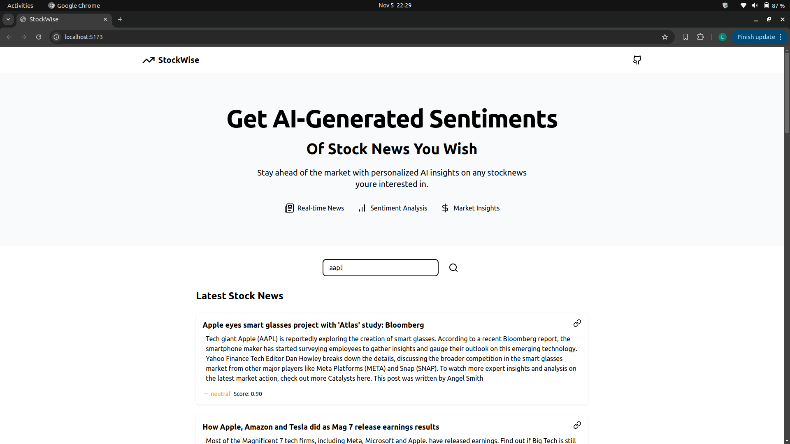
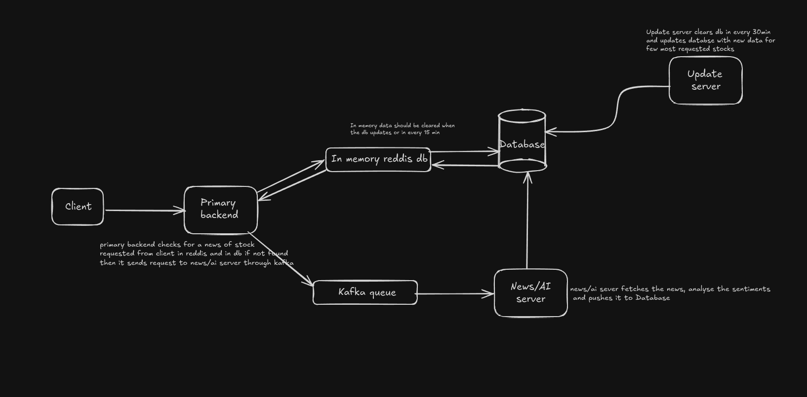

**StockWise** is a web app that scrapes news data from various sources and analyzes the sentiment of news headlines using the Hugging Face FinBERT model. The application uses kafka for a queue management in backend.

Ideal Architecture (working on it)

## Features and Functionality

- **Sentiment Analysis**: Utilizes the FinBERT model to analyze the sentiment of news headlines related to specific stocks.
- **Real-time News Scraping**: Gathers the latest news articles from various financial news sources.
- **User-friendly Interface**: Offers an intuitive web-based interface for searching stock-related news.
- **API Endpoints**: Provides endpoints for fetching news data and sentiment analysis results.

## Tech Stack

- **Backend**:
  - Python
  - Flask
  - MongoDB
  - Kafka
  - Pymongo
  - Transformers (Hugging Face)
